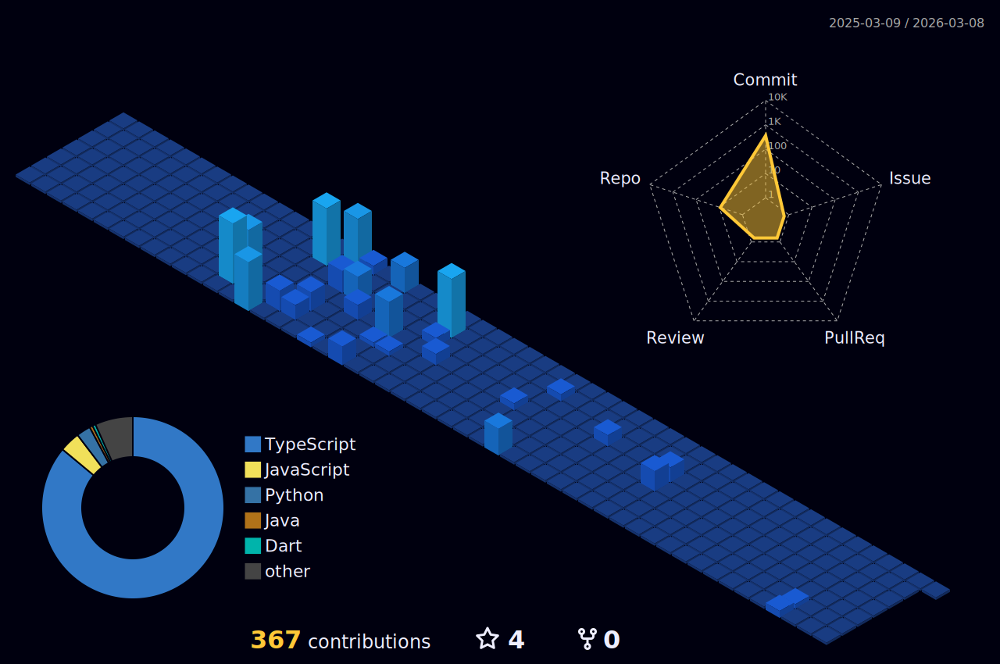

### Hi there 👋

Welcome to my GitHub Profile! My name is **Nilay Goyal** — I’m a Software Engineering + Economics student @ **McMaster University**. Thanks for visiting! Here’s a bit about me:

- 🔭 Currently working as a **Software Developer Co-op @ ICD National Charity**
- 🧬 Prev: **Machine Learning Lead @ iGEM**, **Project Manager @ Project HC**
- 📈 I’m interested in building tools that combine machine learning, systems, and human-centered design.
- 🚀 Projects: ShelfSense, FireAlert, Protein-Ligand Predictors
- 📫 How to reach me: nilay800@gmail.com
- 🌟 Fun fact: I presented a synthetic biology project in **Paris** at iGEM 2024

Check out more about me [here](https://www.linkedin.com/in/nilay-goyal/)
